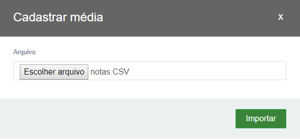

## PROJETO ALUNO FRONT-END


### O que é ?

O Projeto Aluno é um projeto desenvolvido para a participação do processo seletivo da **ALPHA7 DESENVOLVIMENTO DE SOFTWARE LTDA**.
Essa aplicação é apenas o Front-End do projeto.


### Configuração
Se você já está com o Backend Java executando em sua máquina configure a URL nesse projeto da seguinte forma.
Acesse o diretório /js/apiConfig.js e configure a URL da API. 
Ex: 

```javascript
window.__API_URL__ = "http://localhost:8080/api";
```

#### Telas do sistema


1. Cadastro de alunos.
* **Botão Cadastrar:** para cadastrar um aluno clique no botão **inserir**.
* **Botão Editar:** para editar um aluno selecione marcando o campo checkbox e logo após clique em **editar**.
* **Botão Deletar:** para editar um aluno selecione o aluno marcando campo checkbox e logo após clique em **deletar**.


1.1 Formulário para cadastrar o aluno
* O campo nome é obrigatório.
* Preencha o formulário e clique em **inserir**


2. Cadastro de Média
* **Botão Inserir** - para inserir a média de um aluno selecione um aluno marcando o campo checkbox e logo após clique em **inserir**.


2.2 Formulário para cadastrar média. 
* Digite o valor da média e clique em inserir


3. Importação de notas


* **Botão Visualizar:** para visualizar as notas de um aluno selecione um aluno marcando o campo checkbox e logo após clique em **visualizar**.
* **Botão Importar:** para Importar as notas de um aluno selecione um aluno marcando o campo checkbox e logo após clique em **Importar**.
* **Botão Exportar:** para exportar as notas de um aluno selecione um aluno marcando o campo checkbox e logo após clique em **Exportar**. Será gerado um arquivo no formato .CSV.

3.1 Formulário para importar as notas de um aluno.

* Para importar uma prova selecione um arquivo no formato .csv que contenha o padrão da tabela a seguir.

**O arquivo deve conter apenas os valores das colunas sem cabeçalho**

| Matérias        | Data        | Nota  |
| -------------  |:-------------:| -----:|
| M | 17/10/2018 | 10 |
| P | 18/10/2018 |  8 |
| H | 20/10/2018 |  7 |



#### Tecnologias utilizadas
* Bootstrap
* HTML
* CSS
* JavaScript
* jQuery


#### API do Projeto

API JAVA - (https://github.com/JeffersonGibin/projeto-aluno-api)
