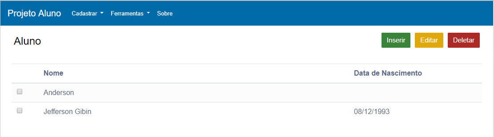
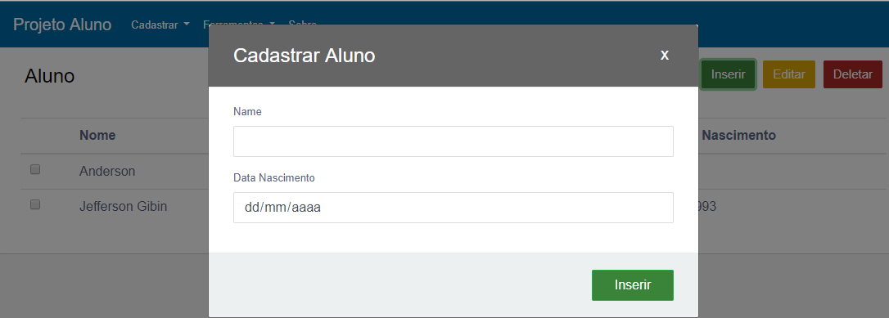
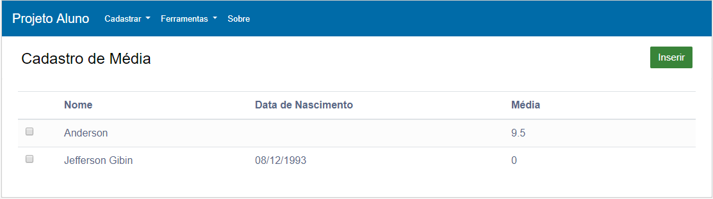
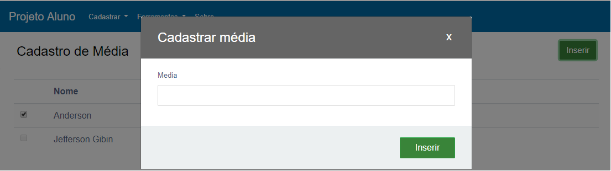
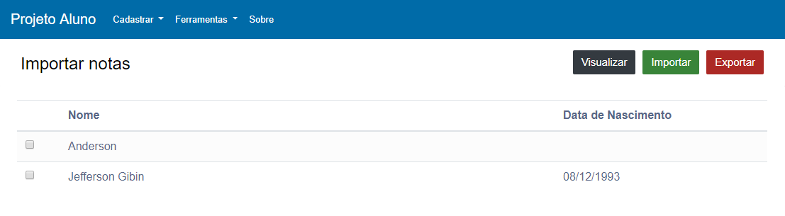

## PROJETO ALUNO FRONT-END


### O que é ?

O Projeto Aluno é um projeto desenvolvido para a participação do processo seletivo da **ALPHA7 DESENVOLVIMENTO DE SOFTWARE LTDA**.
Essa aplicação é apenas o Front-End do projeto.


### Configuração
Se você já está com o Backend Java executando em sua máquina configure a URL nesse proejeto da seguinte forma.
Acesse o diretório /js/apiConfig.js e configure a URL da API. 
Ex: 

```javascript
window.__API_URL__ = "http://localhost:8080/api";
```

#### Telas do sistema


1. Cadastro de alunos.
* **Cadastrar** - para cadastrar um aluno clique no botão **inserir**.
* **Editar** - para editar um aluno selecione marcando o campo checkbox e logo após clique em **editar**.
* **Deletar** para editar um aluno selecione o aluno marcando campo checkbox e logo após clique em **deletar**.



1.1 Formulário para cadastrar o aluno
* O campo nome é obrigatório.




2. Cadastro de Média
***Inserir** - para inserir a média de um aluno selecione um aluno marcando o campo checkbox e logo após clique em **inserir**.




2.2 Formulário para cadastrar média. 



3. Importação de notas


#### Tecnologias utilizadas
* Bootstrap
* HTML
* CSS
* JavaScript
* jQuery


#### API do Projeto

API JAVA - (https://github.com/JeffersonGibin/projeto-aluno-api)
